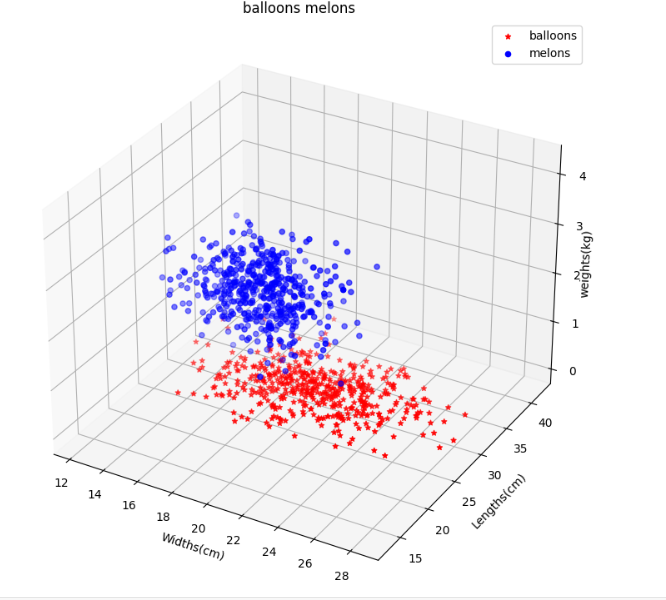
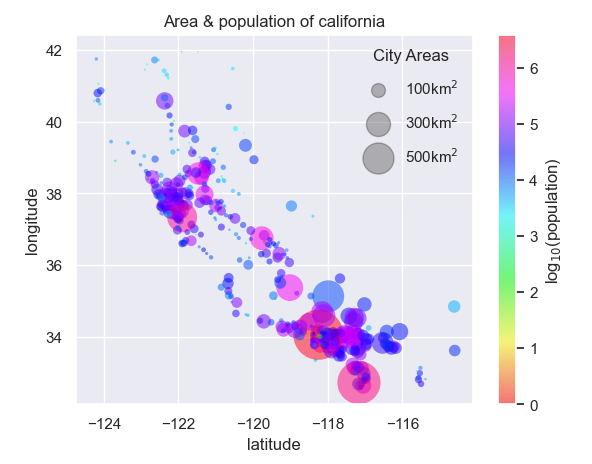

## Balloons and Melons
generating a dataset of random numbers for balloons 🎈 and melons 🍈 problem using three features: length, width and weight. Plot the result in 3D

## California city project on area and population

